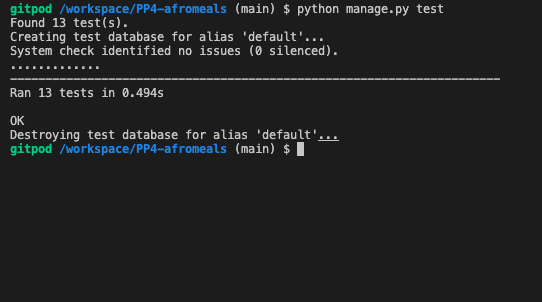

# Afromeals

## Table of Contents
- About us
- User Goals
- Site owner Goals
- User Experience
- User stories
    - siteowners
    - User
- Design
    - Wireframes
    - Fonts
    - Website Pages
    - Database
- Technologies Used
- Validation
- Testing
    - Automated Testing
    - Manual Testing
    - Tests of different devices
    - Browser compatibility
- Bugs
- Heroku Deployment
- Credits
- Acknowledgements

### About

Afromeals is a conceptual enterprise focused on African cuisine, where patrons and everyday individuals gather to share thier experience with African dishes. Visitors can sign up for an account, make table reservations, delve into the blog, and peruse a carefully curated menu of African meals.

### User Goals
- View paginated list of posts
- Cancel booking
- Book a table
- View menu
- Account registration
- Modify and delete comment
- Open a post
- View comments

### Site owner goals
- Avoid double bookings
- Manage bookings
- Approve or disapprove comments
- Update menu
- Manage posts
- Update about us page

## User Experience
- Navigation of blog posts
- Booking Management
- Menu interaction
- User aAccount management
- Admininistarive control and content management
-  Design and Accessability

## User Stories

- As a site user I can view a paginated list of post so that I can select which post I want to view
- As an external user, I can cancel my booking, so that I can manage changes in my schedule
- As an external user, I can book a table for a specific number of guests, date, and time, so that I can ensure my dining plans are scheduled
- As an external user, I can view the restaurant's menu before making a booking, so that I can decide if the offerings meet my preferences or dietary restrictions
- As a Site User I can click on a post so that I can read the full text
- As a Site User  I can view comments on an individual post so that I can read the conversation

### Site Owner
- As a site owner, I can ensure that the booking system prevents double bookings so that the restaurant operates smoothly without overbooking
- As a site owner, I can view and manage all current bookings so that I can effectively plan for guest arrivals and table allocations
- As a site owner, I can update the restaurant's menu on the website so that guests are informed about the latest offerings
- As a Site Admin I can create, read, update and delete posts so that I can manage my blog content
- As a Site Admin I can update the "About Us" page content so that visitors have access to the latest information about our restaurant's mission, history, and team.

### Kanban 
- Github Kanban was used to track all user stories
- Backlog, in progress, Done were used to identify status of tickest on the board

## Design
### Fonts
The fonts used were Google-fonts, Monter
The fonts selected were from Google Fonts, Montserrat wits sans-serif as a backup font.

### Colors
Light themee colors were used for the project with a mix of red, blue and green used as indictaors to give that contrast with the back ground and also have the inviting clourfull effect that would be inviting to vistiors of the site.

### Structure
#### Web pages
- The website features a consistent navigation bar across the top of all pages, enhancing user familiarity with the site layout.
- The footer section of the website includes links to all relevant social media platforms. This enables users to follow Afromeals on these platforms, increasing the business’s social media presence through more followers, likes, and shares.
- Displays interactive cards that allow users to quickly book a table, or browse the food and drinks menus.
- Hosts a paginated display of blog posts, with four entries per page. These posts are contributed by admins or authorized users.
- Shows all current and past bookings made by the user. Past bookings are automatically marked as expired.
- Enables users to log in to access booking features and manage their bookings. Logout functionality is also provided.
- Provides functionality for users to modify their bookings, including changes to the date, time, guest count, and table.
- Allows new users to register, enabling them to use the comprehensive booking system.

#### Database
- Built with Python and the Django framework with a database of a Postgres for the deployed Heroku version - Production

- Database model shows all the fileds stored in the data base

#### Table Model
- table id
- table name
- max_seats

#### Booking Model
- booking id
- created_date
- requested_date
- requested_time
- table
- user
- name
- email
- status
- guest_count

#### Post Model
- id
- title
- slug
- author
- featured_image
- content
- created_on
- status
- excert
- updated_on

#### Comment Model
- id
- post
- author
- body
- approved
- created_on

#### MealItem Model
- meal id
- meal_name
- description
- price
- meal_type
- available

#### DrinkItem
- drink_id
- drink_name
- description
- price
- drink_type
- available

### Wireframes
The wireframes were created using pencil

## Technology Used
### Languages and Frameworks
- HTML
- CSS
- Python
- Django
- Javascript

### Tools
- [Am I Responsive](http://ami.responsivedesign.is/)
- pencil
- [Bootstrap v5.2](https://getbootstrap.com/)
- [Cloudinary](https://cloudinary.com/)
- [Favicon.io](https://favicon.io)
- [Font Awesome](https://fontawesome.com/)
- [GitHub](https://github.com/)
- [Google Fonts](https://fonts.google.com/)
- [Heroku Platform](https://id.heroku.com/login)
- [jQuery](https://jquery.com)
- [Postgres](https://www.postgresql.org/)
- [Summernote](https://summernote.org/)
- Validation:
  - [WC3 Validator](https://validator.w3.org/)
  - [Jigsaw W3 Validator](https://jigsaw.w3.org/css-validator/)
  - [JShint](https://jshint.com/)
  - [Pycodestyle(PEP8)](https://pypi.org/project/pycodestyle/)
  - [Lighthouse](https://developers.google.com/web/tools/lighthouse/)
  - [Wave Validator](https://wave.webaim.org/)

## Validation
- The W3C Markup Validation Service

### JavaScript Validation
JSHint JS Validation Service

### CSS Validation
The W3C Jigsaw CSS Validation Service
[css](staticfiles/images/css_validation.png)

### Lighthouse
Performance, best practices and SEO was tested using Lighthouse.

### Wave
WAVE was used to test the websites accessibility.

## Testing
1. Manual testing
2. Automated testing

### Manual Testing

- As a User I can navigate across the site so that I can move to each feature of the site easily

**Step** | **Expected Result** | **Actual Result**
------------ | ------------ | ------------ |
| Click on the 'Home' link in the navigation bar | Homepage will load| Works as expected |
| Click on the 'Register' link in the navigation bar | Sign up page will load| Works as expected |
| Click on the 'Login' link in the navigation bar | Login page will load| Works as expected |
| Click on the 'Menus' link in the navigation bar, select 'Meal Menu' | Meal menu dropdown will be displayed| Works as expected |
| Click on the 'Menus' link in the navigation bar, select 'Drinks Menu' | Drinks menu dropdwon will be displayed| Works as expected |
| Click on the 'Book' link in the navigation bar | Reservations page will load| Works as expected |
| Click on the 'Reservations' link in the navigation bar | Reservation page will load| Works as expected |
| Click on the 'Logout' link in the navigation bar | Logout page will load| Works as expected |

- As a User I can use a navbar, footer, and locate social icons so that I can navigate the site.

**Step** | **Expected Result** | **Actual Result**
------------ | ------------ | ------------ |
 | Access the navbar and click on tabs| access the different pages assigned to each tab| Works as expected |
 | Scroll to footer at bottom of page | find footer | Works as expected |
 | Scroll to footer at bottom of page | find social links | Works as expected |

 - As a Site User I can register an account so that I can comment on a post

**Step** | **Expected Result** | **Actual Result**
------------ | ------------ | ------------ |
| Click on register and enter my PI details| have access to the comment form and submit a comment to an existing post. | Works as expected |

- As an external user, I can view the restaurant's menu before making a booking, so that I can decide if the offerings meet my preferences or dietary restrictions

**Step** | **Expected Result** | **Actual Result**
------------ | ------------ | ------------ |
| Click on the 'Menu' link on the navbar to view the drink and meal buttons | view menu when i click on the drop down  button| Works as expected |

- As an external user, I can book a table for a specific number of guests, date, and time, so that I can ensure my dining plans are scheduled

**Step** | **Expected Result** | **Actual Result**
------------ | ------------ | ------------ |
| Click on the 'Book' link in the navigation bar | Find the booking form on the reservations page | Works as expected |

- As an external user, I can cancel my booking, so that I can manage changes in my schedule

**Step** | **Expected Result** | **Actual Result**
------------ | ------------ | ------------ |
| From 'Reservations' click 'cancel' on booking to be cancelled| booking is removed form the reservation page  | Works as expected |

- As a Site Admin I can create, read, update and delete posts so that I can manage my blog content

**Step** | **Expected Result** | **Actual Result**
------------ | ------------ | ------------ |
| Visit the admin page  | Enter admin login credentials, gain access to back end | Works as expected |
| Click on Posts  on the left panel, click on add | Form is displayed allowing, editing and deletion, and for creation |Works as expected |

- As a Site Admin I can update the "About Us" page content so that visitors have access to the latest information about our restaurant's mission, history, and team.

**Step** | **Expected Result** | **Actual Result**
------------ | ------------ | ------------ |
| Visit the admin page  | Enter admin login credentials, gain access to back end | Works as expected |
| Click on Aboutus  on the left panel, click on add | Form is displayed allowing, editing and deletion, and for creation |Works as expected |

- As a site owner, I can view and manage all current bookings so that I can effectively plan for guest arrivals and table allocations

**Step** | **Expected Result** | **Actual Result**
------------ | ------------ | ------------ |
| From the admin panel, select Bookings / Food, drinks menus | Find search box and filters on displayed page | Works as expected |

### Automated Testing
- Testing was done using the built in Django module, unittest.

### Device Testing & Browser compatibility

The site used to test on various real world devices was [BrowserStack] 

This allowed me to test on real devices.

The following devices were used to test my site:

## Bugs
 **Bug** | **Fix** |
| ------- | ------- |
| user able to submit incomplete forms| Added required attributes and Django form validations to ensure all fields must be filled out before submission|
| Incorrect user redirection after login | modified the login view to redirect users to the homepage |
| images not displaying in blog posts | updated cloudinary storage settings and ensured the correct media URL configuration settings |
| default image on all blog posts |  |

### Heroku Deployment
This application has been deployed from Github using Heroku. Here's how:

1. Create an account at heroku.com
2. Create an app, give it a name 
3. Click on the settings tab and reveal config vars, Add a key of DISABLE_COLLECTSTATIC and  add avalue of 1
4. Install a ready for production webserver heroku
    - pip3 install gunicorn~=20.1
    - pip3 freeze --local > requirements.txt
5. Create a file named Procfile at your root directory of the project
6. In the Procfile declare this a web process followed by the command to excute the django project 
    - web: gunicorn afromeals.wsgi
7. Open the afromeals/settings.py and replace DEBUG=True with DEBUG = False
8. In settings.py append heroku host name to the ALLOWED_HOSTS list. 
9. On the Heroku website dashboard click on the Deploy tab
10. Enable the Github integration by clicking on connect to Github.
11. Seacrh for repo by typing your repo name this should appear for you to click on it
12. Scroll down to the bottom of the page and click Deploy branch

### Fork Repository
To fork the repository by following these steps:
1. Go to the GitHub repository
2. Click on Fork button in upper right hand corner

### Clone Repository
You can clone the repository by following these steps:
1. Go to the GitHub repository 
2. Locate the Code button above the list of files and click it 
3. Select if you prefere to clone using HTTPS, SSH, or Github CLI and click the copy button to copy the URL to your clipboard
4. Open Git Bash
5. Change the current working directory to the one where you want the cloned directory
6. Type git clone and paste the URL from the clipboard ($ git clone https://github.com/YOUR-USERNAME/YOUR-REPOSITORY)
7. Press Enter to create your local clone.

## Credits
### Code
Code Institute: This project incorporates code modified from the Code Institute's educational materials. These contributions have been instrumental in guiding the development of several features within this application. For further details on their programs, please visit [Code Institute](https://codeinstitute.net)
I Think I Blog Walkthrough: Certain functionalities were inspired by the methods discussed in the "I Think I Blog Walkthrough." These insights have been invaluable for implementing complex features seamlessly. I extend my gratitude to the authors and contributors of the blog for their detailed explanations and examples.

### Images
Images were sourced via google.com

## Acknowledgements
### Special Thanks to the following:
- My Mentor Mo Shami

